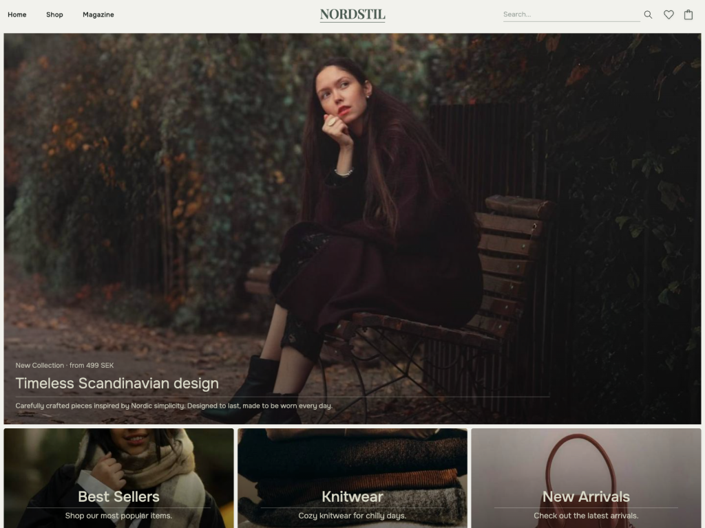
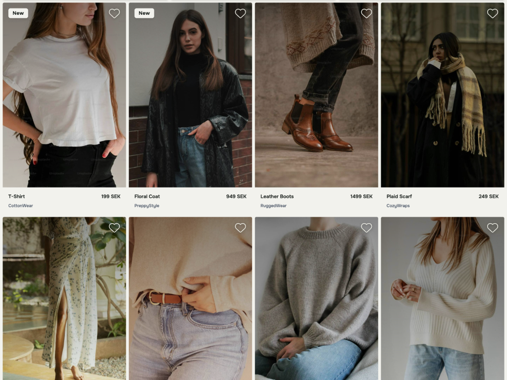
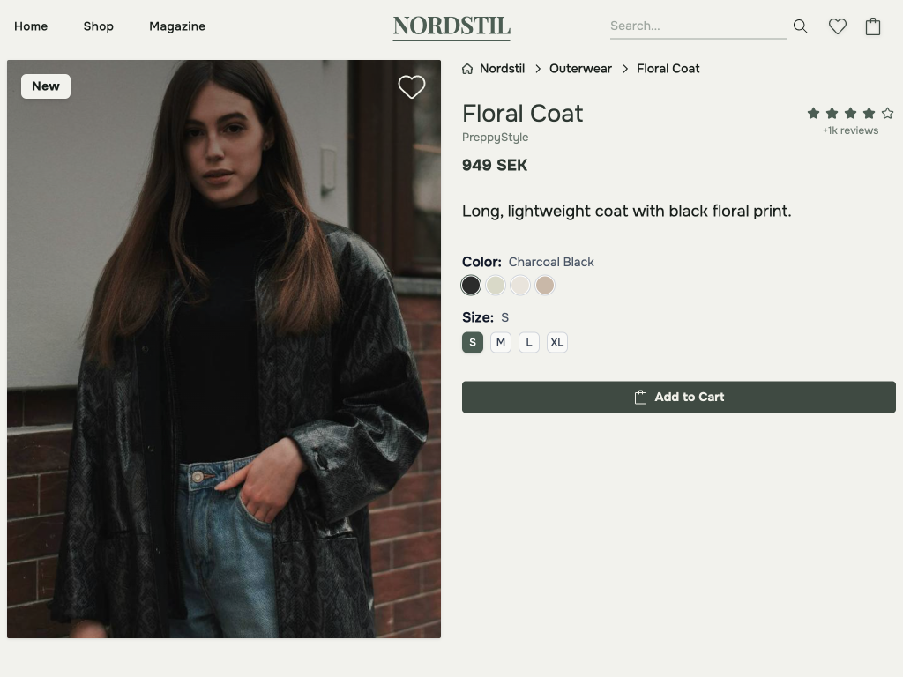
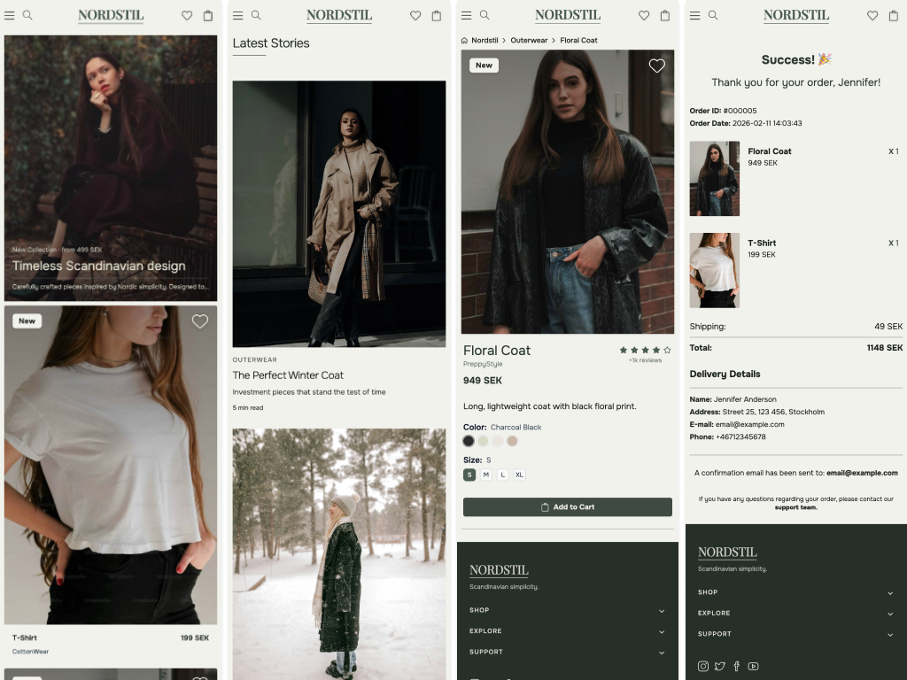
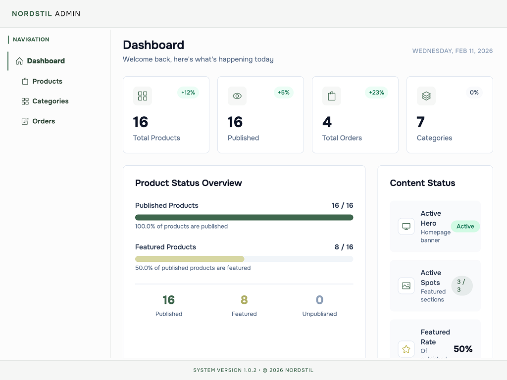
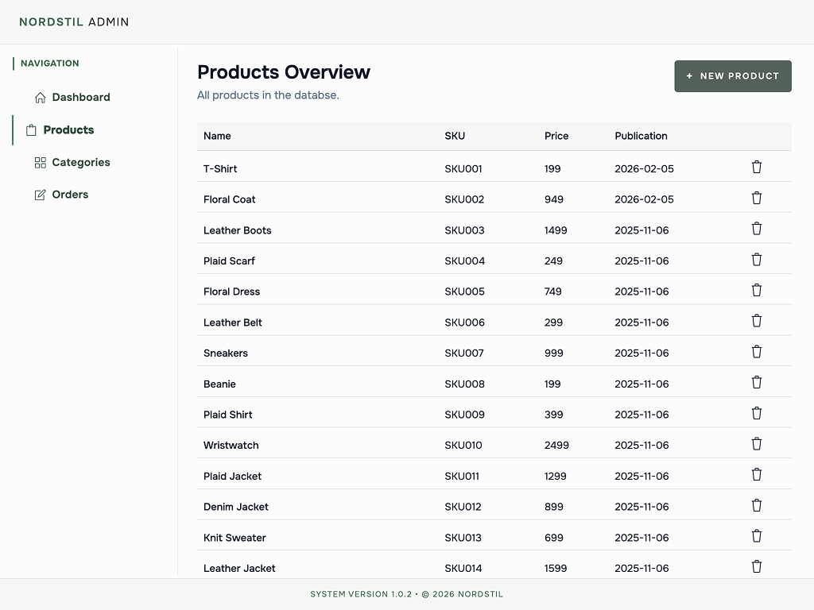

# Nordstil: E-commerce Project

A full-stack e-commerce application built with **Vite**, **React 19**, **TypeScript**, **Node.js**, **Express**, and **SQLite**.

This project focuses on clean architecture, type safety, and practical features that reflect real product workflows.

---

## Overview

Nordstil is a modern online **clothing store** with both a **public storefront** (/) and an **admin dashboard** (/admin).

The app uses a **repository pattern** with SQLite for data persistence, separating concerns between the frontend React application and the backend API.

The admin dashboard includes tools for managing products, categories, and publishing state, with full CRUD operations currently in development.

---

## 🚀 Live Demo

Coming soon...

---

## 📸 Screenshots

### Storefront

<div align="center">
  
  <p><em>Desktop storefront view</em></p>
</div>

---

<div align="center">
  
  <p><em>Product catalog with filtering</em></p>
</div>

---

<div align="center">
  
  <p><em>Product detail page with image gallery</em></p>
</div>

---

<div align="center">
  
  <p><em>Mobile-responsive design</em></p>
</div>

### Admin Dashboard

<div align="center">
  
  <p><em>Admin dashboard overview</em></p>
</div>

<div align="center">
  
  <p><em>Product management interface</em></p>
</div>

---

## Features

### 🛍 Public Storefront (/)

- **Product catalog** with search
- **Product detail pages**
- **Shopping cart** with add/remove functionality
- **Checkout flow** with order creation
- **Custom responsive design** built with Tailwind CSS
- **Client-side routing** with React Router

### 🛠 Admin Dashboard (/admin)

- **Add new products** with image size and color
- **Delete products** from the database
- **Publish / unpublish** products with scheduling
- **Category assignment** to products
- **Product management interface** with real-time search and filtering
- **Data visualization** with product and category statistics
- _Full CRUD operations (edit/update) in progress_

### 💾 Backend & Data Layer

- **HTTP API** with Express
- **SQLite + better-sqlite3** for fast, local queries
- **Repository pattern** separating data access from business logic
- **Many-to-many** relationships between categories and products
- **Order management** with customer and order item tracking
- **Type-safe** data models

---

## 📂 Project Structure

```
nordstil/
├── server/
│   └── src/
│       ├── features/            # Feature modules
│       │   ├── */routes.js      # API route definitions
│       │   ├── */controller.js  # Request handlers
│       │   ├── */service.js     # Business logic
│       │   └── */repository.js  # Data access layer
│       ├── data/                # Database initialization and schema
│       │   ├── db.ts            # Database setup and table initialization
│       │   └── schema.sql       # SQL schema definitions
│       └── server.ts            # Express server setup
│
└── client/
    ├── src/
    │   ├── components/          # React components
    │   │   ├── context/         # React context providers
    │   │   ├── features/        # Feature-specific components
    │   │   ├── ui/              # Reusable UI components
    │   │   └── layout/          # Layout components
    │   ├── hooks/               # Custom React hooks
    │   ├── lib/                 # Utilities and helpers
    │   └── app/                 # Main app, routes, and pages
    └── public/                  # Static assets
```

---

## 🛠 Tech Stack

### Frontend

- **Vite** - Build tool
- **React 19** - UI framework
- **TypeScript** - Type safety
- **React Router** - Client-side routing
- **Tailwind CSS** - Custom styling and design system
- **shadcn/ui** - Select component primitives (Dialog, Button, Card)

### Backend

- **Node.js** - Runtime
- **Express** - Web framework
- **TypeScript** - Type safety
- **better-sqlite3** - Database driver
- **SQLite** - Database

---

## 🚀 Trying it out

### Prerequisites

- Node.js (v18 or higher)
- npm

### Installation

1. **Clone the repository**

```bash
   git clone <repository-url>
   cd nordstil
```

2. **Install backend dependencies**

```bash
   cd server
   npm install
```

3. **Install frontend dependencies**

```bash
   cd ../client
   npm install
```

4. **Start the backend server**

```bash
   cd server
   npm run dev
```

5. **Start the frontend dev server**

```bash
   cd client
   npm run dev
```

The frontend will be available at `http://localhost:3000` and the backend API at `http://localhost:8000`.

---

## 🌱 Future Plans

### 🗄️ Features In Progress

- [ ] **Complete CRUD operations** for products (edit/update functionality)
- [ ] **Complete CRUD operations** for categories
- [ ] **Complete CRUD operations** for orders

### 📋 Planned Features

- [ ] User authentication and authorization
- [ ] Inventory tracking and stock management
- [x] Order creation and management
- [ ] Order history for customers
- [ ] Payment integration

### 🧰 Tooling & Quality

- [ ] Unit and integration tests
- [ ] Seed script for demo data
- [ ] API documentation
- [ ] Environment-based configuration

### 🎨 UI/UX Enhancements

- [ ] Dark mode
- [ ] Image upload with preview
- [ ] Customer accounts and profiles
- [ ] Product reviews and ratings
- [ ] Wishlist functionality

---

## About This Project

I created Nordstil to practice building a full-stack e-commerce system from scratch, focusing on:

- **Clean architecture** with separation of concerns
- **Type safety** across the stack
- **Modern tooling** and best practices
- **Real-world features** like cart management and checkout flows
- **Custom UI design** with a focus on user experience

The project demonstrates how to structure a scalable application with proper data modeling, API design, and component architecture, while building a cohesive design system from the ground up.

---

## 📝 License

This project is open source and available for educational purposes.
